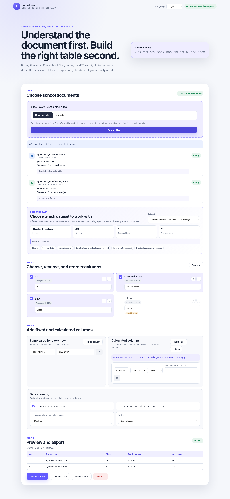

# FormaFlow

[](https://github.com/favi2202/formaflow/actions/workflows/tests.yml)
[](LICENSE)

**Privacy-first local document intelligence for teachers and school staff.**



FormaFlow turns messy Excel, Word, CSV, and supported PDF tables into clean Excel, CSV, or Word outputs. It classifies documents before extracting data, keeps incompatible datasets separate, and lets users review mappings before export.

No cloud AI, accounts, analytics, or external file upload are used.

## Quick start

### Windows

1. Download the repository as ZIP and extract it.
2. Double-click `run.bat`.
3. Open `http://127.0.0.1:8000` if it does not open automatically.

### Linux / macOS

```bash
chmod +x run.sh
./run.sh
```

### Docker

```bash
docker compose up --build
```

Then open `http://127.0.0.1:8000`.

> FormaFlow is a local application, not a GitHub Pages site. Files stay on the user's computer.

## What v0.6 understands

### Input formats

- `.xlsx`, `.xlsm`, genuine binary `.xls`, and `.csv`
- HTML or SpreadsheetML files saved with an `.xls` extension
- `.docx` documents containing one or many tables
- legacy `.doc` files when LibreOffice is installed
- text-based `.pdf` documents and extractable PDF tables

### Document categories

FormaFlow distinguishes:

- student rosters;
- class-promotion documents;
- monitoring sheets;
- assessment-result tables;
- meeting minutes and reports;
- methodical or project documents;
- financial reconciliation documents;
- tests and lesson materials;
- unknown or unsupported documents.

Classification is deterministic and explainable. The interface shows the type,
confidence, evidence, warnings, and available dataset groups.

## Main v0.6 features

### Safe dataset separation

A long Word report may contain a monitoring table, a competition-result table,
and a class-promotion appendix. FormaFlow no longer merges them blindly.
Compatible tables are grouped; incompatible structures remain selectable as
separate datasets.

### Smarter real-world import

- repairs duplicate physical columns created by merged Word cells;
- handles Word rosters with no explicit header row;
- handles one-column class lists;
- recognizes Uzbek, Russian, and English headings;
- reconstructs two-level HTML spreadsheet headers;
- merges continuation/contact rows belonging to one student;
- removes repeated headings, secondary headings, blank numbered rows, and
  common footer labels;
- infers missing row-number, student-name, and class fields from values;
- infers class from document title, file name, or worksheet name;
- warns when inferred class sources conflict;
- avoids using a numeric monitoring data row as the header;
- recovers DOCX table text from `document.xml` when embedded media is damaged;
- warns when an HTML `.xls` is only an index whose sidecar folder is missing;
- warns when a PDF appears scanned and has no selectable text.

### Output builder

- select, rename, and reorder fields;
- add fixed values such as academic year, school, or teacher;
- calculate next class with configurable terminal grades;
- add sequential numbers;
- copy source columns or add a number to numeric values;
- normalize whitespace;
- skip blank rows;
- remove exact duplicate output rows;
- sort by a selected field;
- preview before export;
- export XLSX, CSV, or DOCX.

### Languages

The interface can switch between:

- English;
- Uzbek Latin;
- Russian.

## Run on Windows

1. Extract the ZIP into a normal folder.
2. Close any older FormaFlow server window.
3. Double-click:

```text
run.bat
```

The script checks the required packages, installs missing ones, starts the local
server, and opens:

```text
http://127.0.0.1:8000
```

Manual start:

```powershell
python -m pip install -r requirements.txt
python app.py
```

## Run on Linux or macOS

```bash
chmod +x run.sh
./run.sh
```

## Legacy `.doc` support

Old binary Word `.doc` files are converted locally through LibreOffice. Install
LibreOffice if a legacy document cannot be opened. Modern `.docx` files do not
need LibreOffice.

## PDF limitations

FormaFlow reads selectable PDF text and tables. It does **not** perform OCR in
v0.6. A scanned image-only PDF is classified as far as possible and receives a
clear warning, but its text cannot yet be extracted.

## Privacy

- no cloud file upload;
- no external AI API;
- no database of students;
- no analytics or telemetry;
- sessions exist only in server memory;
- restarting FormaFlow clears all session data;
- exported files are written only when the user downloads them.

Use anonymized copies while developing or reporting bugs. Do not commit real
student files to a public repository.

## Tests

Install development dependencies and run:

```bash
python -m pip install -r requirements-dev.txt
pytest -q
```

Current packaged suite:

```text
27 tests passed
```

The tests use synthetic information only. They cover Excel, legacy XLS,
HTML-as-XLS, SpreadsheetML, DOCX tables, PDF classification, headerless rosters,
monitoring headers, repeated headings, dataset grouping and switching, class
inference, calculated columns, and all export formats.

## Verified corpus behavior

The importer was stress-tested locally against a varied set of real document
structures without packaging those private files. The corpus included class
rosters, a multi-class promotion document, monitoring workbooks, meeting
minutes with several unrelated table types, methodical projects, a financial
reconciliation document, malformed DOCX media, a scanned/structured PDF mix,
and an HTML `.xls` index missing its sidecar folder.

In a combined 33-file validation run, FormaFlow:

- parsed 32 files successfully;
- identified the one structurally invalid zero-filled DOCX clearly;
- kept promotion, roster, monitoring, and financial datasets separate;
- produced 15 selectable dataset groups instead of combining incompatible data.

## Known limitations

- OCR for scanned PDFs is not included yet;
- exact user-supplied Word template filling is planned for a later version;
- some highly designed Word/PDF tables may still need manual dataset selection;
- monitoring tables with genuinely different question layouts intentionally
  remain separate;
- an HTML `.xls` that references a missing companion folder cannot be fully
  reconstructed from the index file alone;
- automatic decisions should still be reviewed before working with official
  school records.
